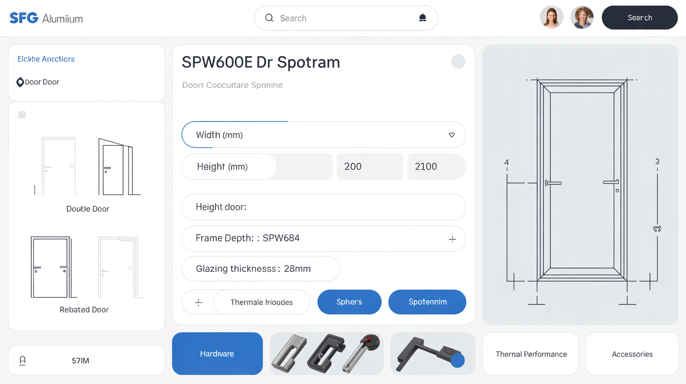
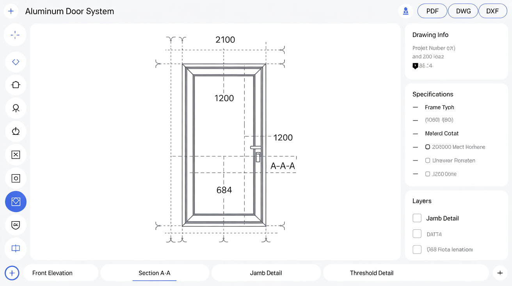
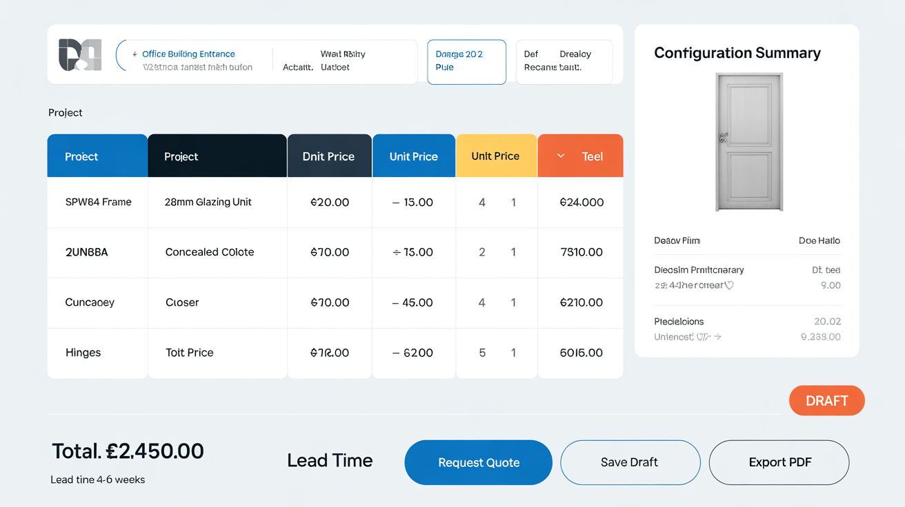
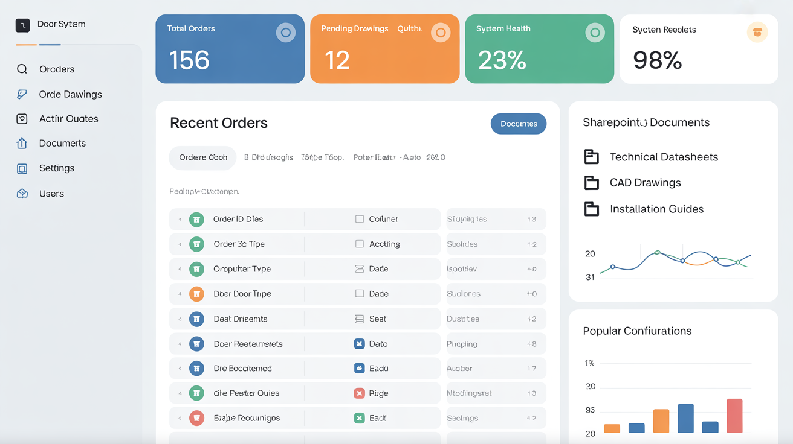

# SPW600e Door System - Design Documentation

This directory contains comprehensive design documentation and UI mockups for the SPW600e Door System application.

## 📋 Documentation

### [Comprehensive Design Plan](./COMPREHENSIVE_DESIGN_PLAN.md)
**6,300+ lines | 25+ ASCII diagrams | 30+ code examples**

A complete technical specification covering all aspects of the SPW600e Door System application:

#### Key Sections:
1. **System Architecture** - Multi-tier architecture with React frontend, Node.js backend, PostgreSQL database
2. **Webhook System** - 20 comprehensive webhook events with retry mechanisms and circuit breaker patterns
3. **Database Schema** - Complete ERD with 15+ tables, relationships, and indexes
4. **SharePoint Integration** - Document management, technical drawings, and quote storage
5. **Security & Authentication** - JWT with MFA, RBAC, encryption at rest and in transit
6. **API Specifications** - RESTful endpoints with detailed request/response schemas
7. **Frontend Architecture** - React components, state management, routing
8. **Backend Services** - Business logic, validation, error handling
9. **Testing Strategy** - Unit, integration, E2E testing approaches
10. **Deployment & DevOps** - Docker, Kubernetes, CI/CD pipelines
11. **Monitoring & Logging** - Application metrics, error tracking, audit logs
12. **Performance Optimization** - Multi-layer caching, database optimization, CDN strategy
13. **Scalability** - Horizontal scaling with Kubernetes, load balancing
14. **Disaster Recovery** - Backup strategies, failover mechanisms
15. **Product Roadmap** - v2.0 (Q1 2026), v2.5 (Q3 2026), v3.0 (2027)

#### Major Features:
- **Enhanced Webhook System**: 20 events covering configuration, quotes, orders, technical drawings, users, system health
- **Advanced Security**: JWT authentication with MFA, role-based access control, encryption
- **Scalability**: Horizontal scaling with Kubernetes, auto-scaling policies
- **Performance**: Multi-layer caching (Redis, CDN), database optimization
- **Future Vision**: 3D visualization, AI-powered optimization, predictive analytics

---

## 🎨 UI Mockups

Professional UI mockups showcasing the application's user interface design:

### 1. Main Configuration Dashboard


**Features:**
- Interactive door configuration panel with real-time 3D preview
- Component selection (frame, glass, hardware, accessories)
- Live price calculation and specification summary
- Responsive layout with intuitive navigation

---

### 2. Technical Drawing Viewer


**Features:**
- Advanced CAD drawing viewer with zoom and pan controls
- Dimension annotations and measurement tools
- Layer management and view controls
- Export options (PDF, DWG, DXF)
- SharePoint integration for document storage

---

### 3. Quote Request Interface


**Features:**
- Comprehensive quote request form
- Project details and customer information
- Configuration summary with itemized pricing
- Document attachment support
- Status tracking and approval workflow

---

### 4. Admin Dashboard Panel


**Features:**
- System analytics and KPI metrics
- User management and role assignment
- Configuration management (products, pricing, rules)
- Webhook monitoring and system health
- Audit logs and activity tracking

---

## 🚀 Implementation Status

- ✅ **Design Phase**: Complete
- ✅ **Documentation**: Comprehensive design plan finalized
- ✅ **UI/UX Design**: Mockups created and reviewed
- 🔄 **Development**: Ready to begin implementation
- ⏳ **Testing**: Pending development completion
- ⏳ **Deployment**: Planned for post-testing

---

## 📁 Directory Structure

```
apps/spw600e-door-system/
├── docs/
│   ├── README.md                          # This file
│   ├── COMPREHENSIVE_DESIGN_PLAN.md       # Complete technical specification
│   └── ui-mockups/                        # UI design mockups
│       ├── 01-main-configuration-dashboard.png
│       ├── 02-technical-drawing-viewer.png
│       ├── 03-quote-request-interface.png
│       └── 04-admin-dashboard-panel.png
├── frontend/                              # React frontend (to be implemented)
├── backend/                               # Node.js backend (to be implemented)
└── database/                              # Database migrations (to be implemented)
```

---

## 🔗 Related Resources

- **Repository**: [sfg-app-portfolio](https://github.com/sfgaluminium1-spec/sfg-app-portfolio)
- **Project**: SPW600e Door System
- **Technology Stack**: React, Node.js, PostgreSQL, Redis, SharePoint
- **Deployment**: Docker, Kubernetes, Azure/AWS

---

## 📝 Version History

- **v1.0** (November 2025) - Initial design documentation and UI mockups
  - Comprehensive design plan with 6,300+ lines
  - 4 professional UI mockups
  - Complete technical specifications
  - Product roadmap through 2027

---

## 👥 Contributors

- **Design Team**: SFG Aluminium Specification Team
- **Documentation**: AI-Assisted Technical Writing
- **UI/UX Design**: Professional Mockup Generation

---

## 📄 License

Proprietary - SFG Aluminium Ltd. All rights reserved.

---

*Last Updated: November 7, 2025*
